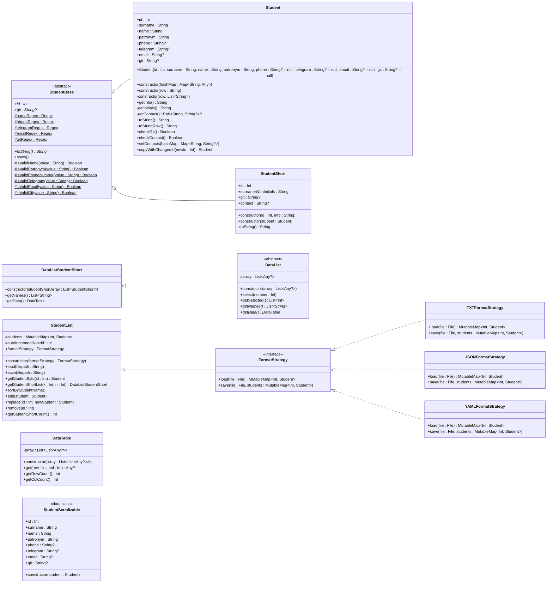
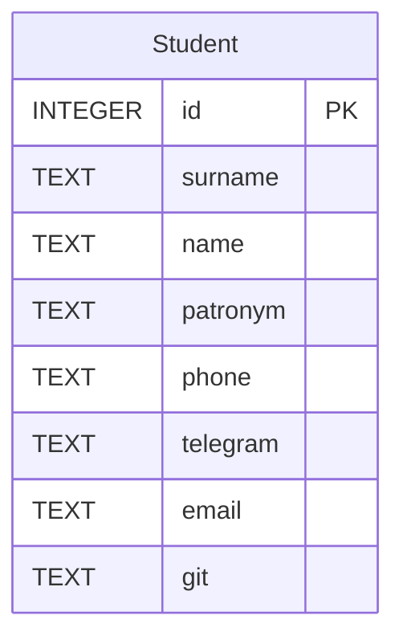

<h2 align="center">A repo for my university homework on software design patterns  </h2>

Диаграмма классов

##

ER-диаграмма базы данных

##
<h3> </h3>

<a href="https://youtu.be/bUh2W3jjapA"></img></a>

